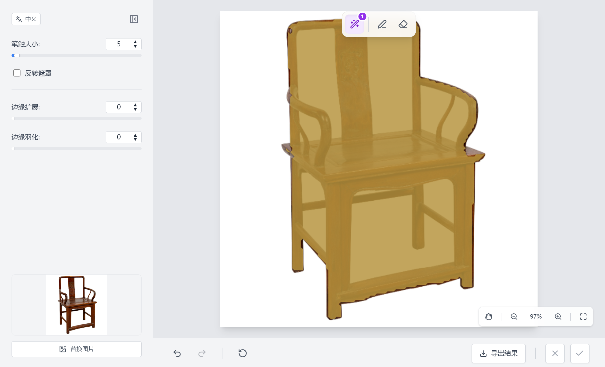

# Run and deploy your AI Studio app

This contains everything you need to run your app locally.

在 AI Studio 中查看：https://ai.studio/apps/drive/1FZ-NMHgsf-t5_TdY7974HF3POubxeuT2
View in AI Vercel: https://panoptic-segmentation.vercel.app/

## Run Locally

**Prerequisites:**  Node.js

1. Install dependencies:
   `npm install`
2. Set the `GEMINI_API_KEY` in [.env.local](.env.local) to your Gemini API key
3. Run the app:
   `npm run dev`
